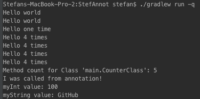

# A simple Java annotation example
## Get the sample
Simply clone this repo and open the `build.gradle` in the root directory with IntelliJ or your favorite IDE.
After that call
```
./gradlew run -q
```
The output looks like the Screenshot below.
## Screenshot

## About the annotations
All annotations are just for fun. Nothing special expected here :)
* `@Print` - use it to print a simple message. Optional you can put times for multiple output.
* `@PrintLn` - just print "Hello World".
* `@MethodCalculation` - it will  display the count of methods in a class.
* `@FieldCallMethod` - declare a field with a method name to call the specific method.

## The Binder.class
Contains all the logic for annotations. Use the class like this:
```java
Binder.bind(Any.class)
```
All annotations are analyzed in `Any.class` and the specific function will be called.
# Links that helped me a lot
* [Favor](https://github.com/soarcn/Favor)
* [Mkyong](http://www.mkyong.com/java/java-custom-annotations-example/)
* [ButterKnife](https://github.com/JakeWharton/butterknife)
